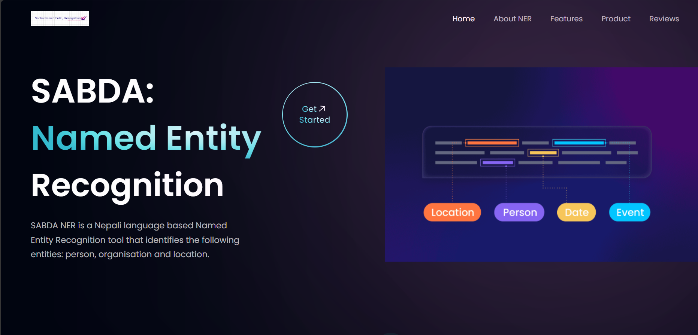
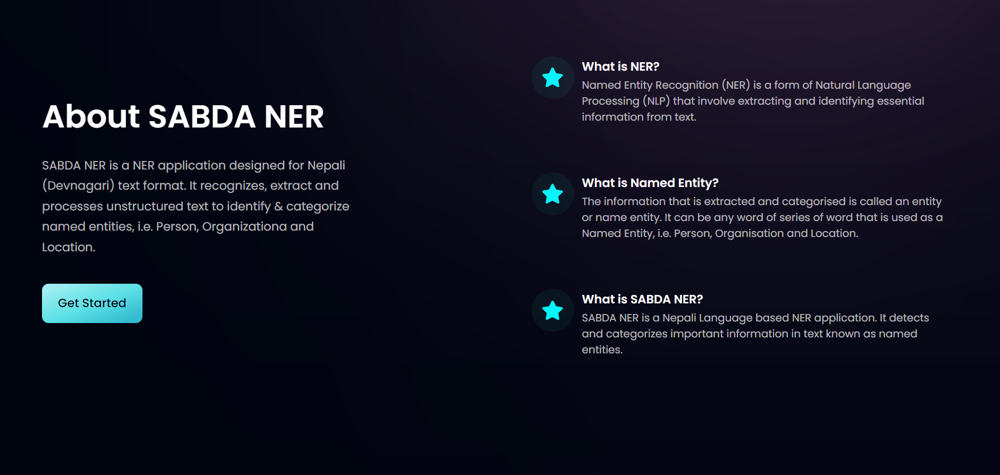
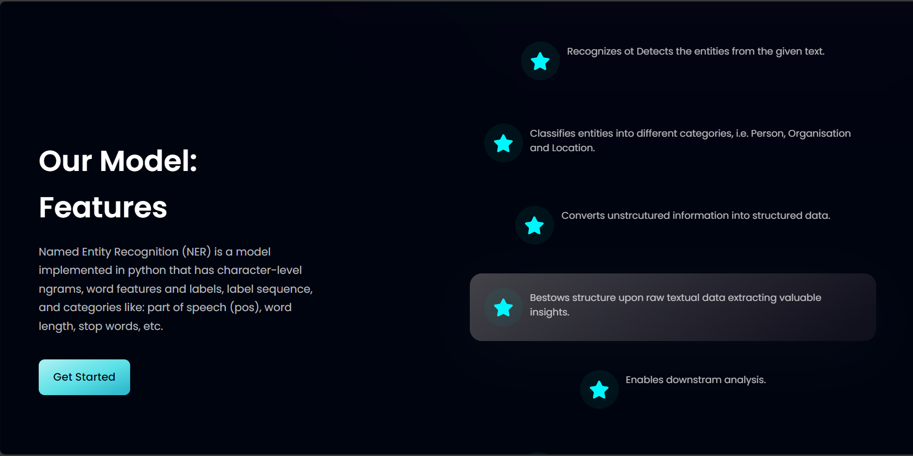
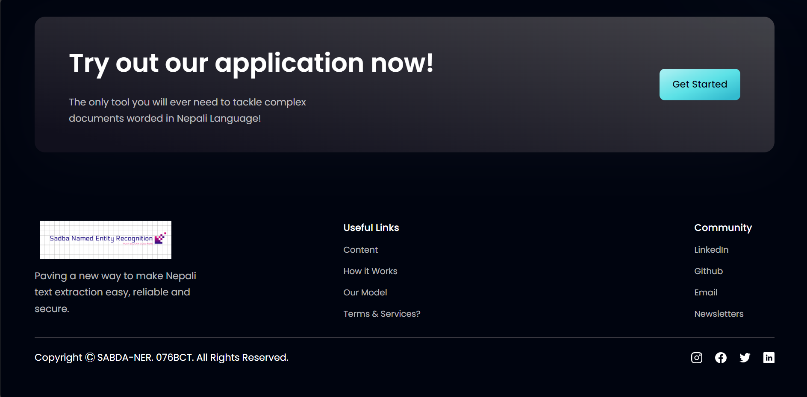

# SABDA-NER-UI

Below are our UI pages build in Vue.js. Use **npm run dev** to run the UI if you thought to use it. We have used Flask API where we deployed our model. You can use any thing.

* Home page 

* About us

* Feature

* Input

* Footer

Our FrontEnd Developer: **Aishwarya Shrestha**

* [Github](https://github.com/aish-wa-rya)
* [LinkedIn](https://www.linkedin.com/in/aishwarya-shrestha-43a9841a1/)

